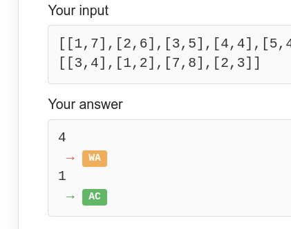

leetcode-example-output-checker
=====

## Overview

Check if "Run Code" result is correct when "Use Example Testcases" during LeetCode contests.

- WA: Wrong Answer
- AC: Accepted (Correct Answer)

## Greasy Fork

- [leetcode\-example\-output\-checker](https://greasyfork.org/ja/scripts/445668-leetcode-example-output-checker)

## Usage

Please use Tampermonkey or other software to run this script.

## Update History

- 1.0.0 (2022.5.29)
  - First release
